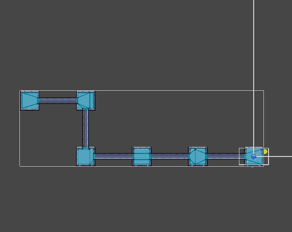
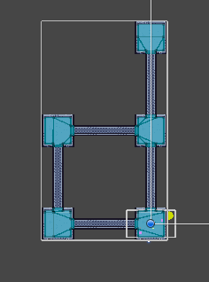
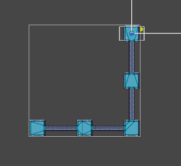
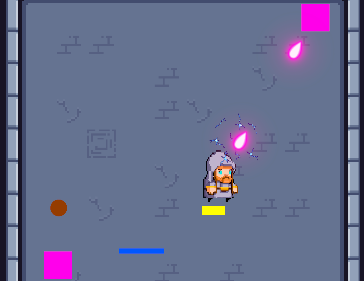
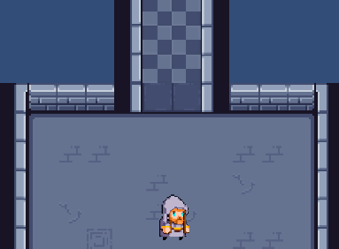

# 🎮 Pixel Dungeon Crawler Project (Still Developing)

[]
]

 A dungeon crawler game in **Top-down pixel art** style, with rooms and corridors. Explore randomly generated maps, fight enemies and collect treasures!  

---

## 📸 Screenshots 
**Procedural dungeon generation :**

 

 

**In-game Screenshots (The game is not finished yet, this is just a gameplay demo!!!):**

 

---

## 🛠️ Features 
- **Procedural dungeon generation** (Randomly generated map) 
- **Pixel art graphics** 
- **Room-corridor linked map system** 
- **Enemy AI and combat mechanics** 
- **Item collection and inventory management** 

## 🛠️ Map generation logic
- **When the game starts, rooms are placed according to the randomly generated map.**
- **Corridors are placed between the rooms.**
- **After the rooms are formed, each room determines for itself in which directions there are neighbors or not.**
- **The rooms find their own borders and if there are neighbors in that direction, they put a wall if there is no corridor door.**

## Extra Information
- **When the character enters the dungeon, the doors automatically close and after all waves are over, the doors open and the character continues the game.**
